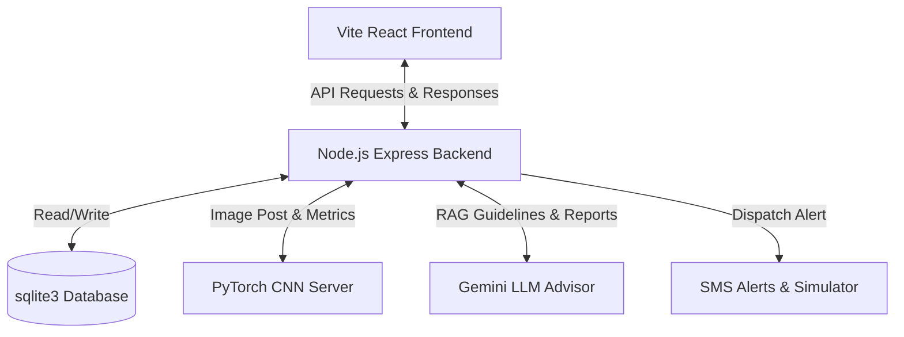

# Vita-Core Sentinel AI

`Vita-Core Sentinel AI` is a state-of-the-art agricultural monitoring platform designed for real-time soil health assessment using **Mycelial Glow Ingestion & Analytics**. By leveraging a PyTorch CNN model to analyze mycelial bioluminescent glow images and integrating with Google Gemini for RAG-enabled agronomy advisory, it empowers farmers with actionable, real-time insights and automated cellular alerts.

---

## 🏗️ System Architecture

The platform is designed around a three-tier architecture:



### 1. **Vite React Frontend** (`/frontend`)
- A modern, interactive dashboard built using **React 19**, **Vite**, and styled with **Tailwind CSS v4**.
- Uses **Recharts** for visualizing historical soil metrics (nitrogen, moisture, pH, and stress levels).
- Interactive Canvas heatmap representing different field sectors and their real-time stress levels.
- File-upload portal allowing farmers to upload new mycelial glow images for immediate analysis.

### 2. **Node.js Express Backend** (`/backend`)
- REST API layer managing user authentication (with JWT and bcryptjs) and ingestion.
- Built on top of **SQLite** (`sentinel.db`) with an asynchronous query wrapper (`database.js`).
- Handles file uploads using **Multer**.
- Integrates with the **Google Generative AI SDK** to provide AI-powered agronomy remediation reports.
- Dispatches emergency cellular SMS alerts using **Twilio** (falls back to a simulated SMS logger).

### 3. **AI PyTorch CNN Server** (`/ai`)
- Runs a lightweight Python Flask server on port `5001`.
- Uses a custom **PyTorch Convolutional Neural Network (CNN)** (`model.py` / `mycelium_cnn.pth`) to process and analyze bioluminescent mycelial glow patterns.
- Predicts key soil metrics:
  - **Nitrogen Level** (mg/kg)
  - **Moisture Content** (%)
  - **Soil pH**
  - **Stress Classification** (Low / High)

---

## 📂 Project Directory Structure

```text
Project/
├── ai/                      # Python PyTorch CNN Model Server
│   ├── glow_server.py       # Flask server hosting the CNN model
│   ├── glow_analyzer.py     # Image preprocessing & analysis logic
│   ├── model.py             # Custom PyTorch CNN architecture
│   ├── train_model.py       # Model training script
│   └── mycelium_cnn.pth     # Pre-trained CNN model weights
│
├── backend/                 # Node.js Express API Backend
│   ├── server.js            # Main backend API entry point
│   ├── database.js          # SQLite connection and database init
│   ├── ai_bridge.js         # Integration wrapper calling the AI server
│   ├── sms_simulator.js     # Twilio SMS dispatch & logging simulator
│   ├── crop_guidelines.json # Reference guidelines for optimal soil metrics
│   ├── sentinel.db          # SQLite Database file
│   └── uploads/             # Directory for uploaded mycelial images
│
├── frontend/                # Vite + React 19 Frontend
│   ├── src/                 # React source code (components, hooks, styles)
│   ├── public/              # Static assets
│   ├── tailwind.config.js   # Tailwind CSS configuration
│   └── index.html           # Main entry document
│
├── node_portable/           # Bundled portable Node.js runtime (v22.12.0)
│
├── start_sentinel.ps1       # PowerShell launcher script
├── start_sentinel.bat       # Windows Batch launcher script
└── README.md                # System documentation
```

---

## ⚙️ Setup & Configuration

### Prerequisites
1. **Python 3.8+** (with PyTorch, Flask, NumPy, and OpenCV/Pillow installed).
2. **Node.js** (A portable node version `v22.12.0` is pre-bundled in `node_portable/` for convenience).

### Environment Variables (`backend/.env`)
Configure your backend environment parameters inside [backend/.env](file:///c:/Users/SHIVANESH/OneDrive/Desktop/Project/backend/.env). Key parameters include:

```ini
PORT=5000
JWT_SECRET=vitacore_secret_jwt_key_2026

# Google Gemini API (for LLM Agronomy Advisor)
GEMINI_API_KEY=your_gemini_api_key_here

# Twilio Configuration (for SMS alerts)
TWILIO_ACCOUNT_SID=your_twilio_sid
TWILIO_AUTH_TOKEN=your_twilio_auth_token
TWILIO_FROM_NUMBER=your_twilio_phone_number
FARMER_PHONE_NUMBER=recipient_phone_number
```

---

## 🚀 Running the Application

For convenience, you can launch all three components (AI Server, API Backend, React Frontend) simultaneously using the provided startup scripts:

### On Windows (PowerShell)
Execute the PowerShell script from the project root:
```powershell
.\start_sentinel.ps1
```

### On Windows (Command Prompt)
Double-click or run the batch script:
```cmd
start_sentinel.bat
```

The scripts will automatically:
1. Bind the portable Node.js environment.
2. Launch the **AI Model Server** in a separate window (Port `5001`).
3. Launch the **Express API Backend** in a separate window (Port `5000`).
4. Launch the **Vite React Dev Server** in a separate window (Port `5173`).
5. Open your default web browser and navigate to the portal at `http://localhost:5173/`.

---

## 📊 Core Features & Functionalities

### 📷 Bioluminescent Mycelial Glow Ingestion
Farmers can upload images of bioluminescent mycelium cultures grown on soil samples. The pre-trained PyTorch CNN analyzes the bioluminescent patterns (intensity, distribution, texture) to diagnose soil composition.

### 📈 Soil Health Dashboards
Real-time metrics tracking:
- **Nitrogen Deficiency Detection**: Triggers alerts if levels fall below optimal thresholds.
- **Moisture Stress**: Identifies dehydration or waterlogging.
- **pH Mapping**: Detects acidic or alkaline extremes.

### 📱 Automated Alert Dispatches
If high stress is detected in any agricultural sector, an automated alert is created. If Twilio is configured, the backend dispatches a cellular SMS to the farmer containing critical soil metrics.

### 🤖 RAG-Enabled AI Advisor
Utilizes Google Gemini to provide a dynamic remediation strategy. When a sector experiences issues, the AI analyzes historical metrics against target crop guidelines to formulate specific corrective instructions (e.g., nitrogen fertilization, pH neutralization).